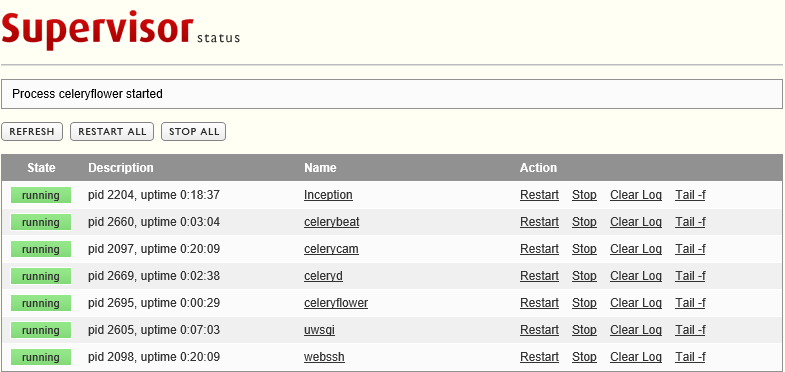
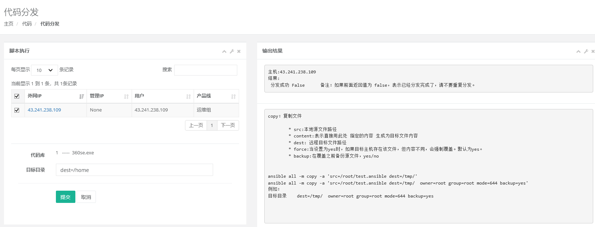
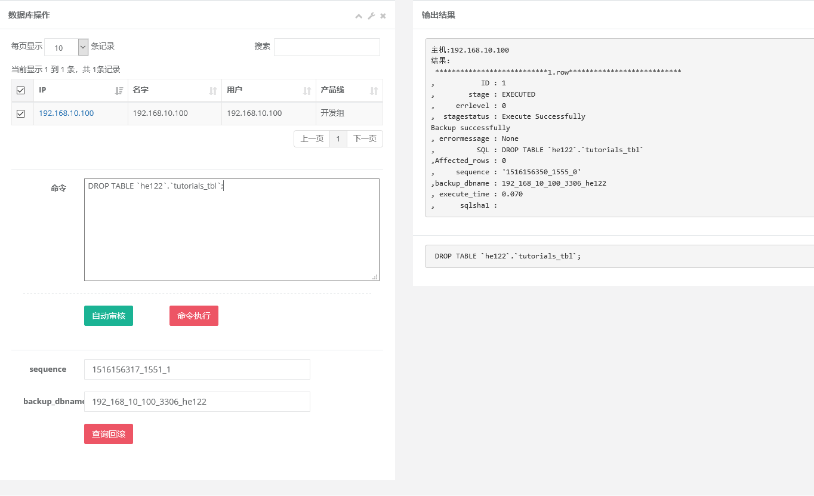

## AutoOps

AutoOps 是一款基于 2.0 版本django开发的，主要面向linux运维工程师使用,管理linux资产信息，Mysql数据库，批量执行命令、脚本,获取流量图，web ssh管理，技术文档等功能。

欢迎大家测试使用，有问题可反馈。


###  Demo

  -  地址:  `http://42.62.55.58:8003/`        账号`admin`      密码`1qaz.2wsx`
  -  交流群号： `620176501`   欢迎交流！  
  -  后台地址 `http://42.62.55.58:8003/admin`     账号`admin`   密码`1qaz.2wsx`
  -  博客:    `http://hequan.blog.51cto.com/`
  -  github:  `https://github.com/hequan2017/autoops/`
  -  码云:    `https://gitee.com/hequan2020/autoops`

###  架构图

 


### 更新记录  

  -  1.7.8  更换后台为xadmin
     -  注意： xadmin暂时不支持 对象权限组件django-guardian,需要设置的时候，可以登陆dadmin（为默认admin）
     -  注意： xadmin  认不到 tasks任务的名字，需要的名字如下：
        -  tasks.task.任务
        -  tasks.task.monitor_job
        -  tasks.task.clean_history_host_monitor
        -  tasks.task.cmd_job
        
  -  1.7.7   更换webssh启动方式。
  -  1.7.6  代码库功能上线，带分发。
  -  1.7.4  更新ansible版本。 增强命令行 功能。具体方法参考ansible 模块。
 
  -  1.6.7   权限梳理，若干代码优化。
      -  根据后台用户组进行区分。admin有最高权限。
      -  例如：新建  运维组、开发组 ， 新建 运维组 里面的 hequan 账号
      -  那么  hequan 只能看见 运维组下面的服务器、数据库，执行工具也只能选择 运维组的。 hequan 无法添加服务器、数据库。
     
  -  1.6    Mysql数据库操作: 自动审核 + 执行 （目前只适用于Mysql）  
      -  自动审核： 利用软件去审核命令是否正确。
      -  命令执行： 去数据库执行命令，会忽略报警和警告，使用前建议 先 自动审核一下。  
      -  回滚功能
  
  -  1.4    更新django 为2.0
  -  1.3    新增 技术文档 板块。
  -  1.2    权限管理完善。 增加附件上传下载功能。
  -  1.1.5  新增 权限管理。 根据后台用户组，区分不同权限。如：在后台先建一个 测试机 组，把普通用户加入到此组。在前端添加资产时，在产品线中会出现测试机 。 测试机组下的用户 只管管理测试机产品线的资产。             
  -  1.1    新增 平台登录记录、web登录记录、密码修改等功能。


###  功能
  - asset资产
    - api     `http://42.62.55.58:8003/asset/api/asset.html`
    - 自动获取服务器信息
    - 全部导出
    - CPU 内存 流量图
  - names 用户（预留模块）
      -  加密解密   password_crypt.py          ## 如果是自己的生产环境，建议更换里面的密钥。 
  - tasks任务 
     - 命令行
     - 工具  
        - shell 
        - python
        
  - webssh  登陆
     -  借鉴的 github上的  https://github.com/huashengdun/webssh
  
  - library 技术文档 (真正运维人员的管理平台，自带技术文档，有问题不用再去别的地方找)
    - DjangoUeditor 富文本编辑器
    
  -  代码库
     - 代码库
     - 主机分发
    
  - 数据库自动审核-- 命令执行   回滚
     - Inception 
     
  - 后台管理
    - admin     
   
   

### 环境

   * Python 3.6.4         #可以参考   `script/install_python3.6.4.py`
   * Django 2.0
   * Python 2.7            (用来启动 supervisor)
   * Centos 7.4
   
   * supervisor       管理无法
     * uwsgi                    web服务启动
     * webssh                
     * celeryd                 队列任务
     * celerybeat
     * celerycam
     * celeryflower
     * Inception             mysql 数据库审核

   
### 安装 

   * 开发环境部署：
   
   1. 下载，安装基本环境,安装目录为/opt下，如是其他目录，请修改supervisor.conf中的相应设置即可。
 
```bash
cd /opt
yum install git   sshpass    redis  -y 
systemctl enable redis.service 
systemctl start  redis.service 
git  clone  https://github.com/hequan2017/autoops.git
    
cd   autoops/
pip3 install -r requirements.txt       
pip3 install git+git://github.com/sshwsfc/xadmin.git@django2 
``` 

   添加的资产里面,  建议执行  ` yum install  ipmitool     dmidecode   -y  `以获取更多信息
   
   2. 安装   `supervisor  `
 
```bash
chmod +x    /opt/autoops/script/inception/bin/*
pip2   install    supervisor          ## 没有pip2 版本的 ，可以参考 script/install_pip2.sh
echo_supervisord_conf    > /etc/supervisord.conf 
mkdir /etc/supervisord.d/
     
vim /etc/supervisord.conf      ##进行相关设置
         
[inet_http_server]             ##HTTP登录账号密码
port=0.0.0.0:9001 
username=user
password=321

[include]
files = /etc/supervisord.d/*.conf
```
```bash
cp   /opt/autoops/script/supervisor.conf               /etc/supervisord.d/        
```
    
 

###  环境设置

  * 数据库: 请修改 `autops/settings`文件, 如果没有mysql，请选择上面那种。如果有，则可以启用mysql，设置相关连接地址。
     关于mysql安装方法，可参考我的博客 `http://hequan.blog.51cto.com/5701886/1982428`


```djangotemplate
DATABASES = {
     'default': {
        'ENGINE': 'django.db.backends.sqlite3',
         'NAME': os.path.join(BASE_DIR, 'db.sqlite3'),
     }
 }
 
 
DATABASES = {
       'default': {
           'ENGINE': 'django.db.backends.mysql',
           'NAME': 'autoops',
           'USER': 'root',
           'PASSWORD': '123456',
           'HOST': '192.168.10.24',
           'PORT': '3306',
        }
}
``` 
  * 修改 autoops/settings 自定义参数
  
```djangotemplate
DEBUG = True                            ## 实际生产环境使用，请关闭    False

BROKER_URL = 'redis://127.0.0.1:6379/0'                  ##Redis地址,一般情况不用修改


Webssh_ip = '42.62.55.58'      ##WebSSH 软件的 访问IP,也就是本机外网IP，改这个地方就好了。
Webssh_port='9000'             ##端口号,默认即可。如有修改，需要修改  webssh/main.py文件 define('port', default=9000, help='listen port', type=int)

Inception_ip = '127.0.0.1'         ## 此为 Inception 软件地址,  默认为本机地址，一般不用修改
Inception_port = '6669'            ## 此为 Inception 软件端口号


inception_remote_system_password='654321'    ## 设置回滚备份（mysql）服务器相关参数，并同步修改一下 script/inc.cnf 里面的设置
inception_remote_system_user='root'
inception_remote_backup_port='3306'
inception_remote_backup_host='192.168.10.100'   ##设置备份数据库地址
```  

  * 修改一个文件 `/usr/local/lib/python3.6/site-packages/django/db/backends/mysql/base.py`   注释35 36 以下两行,找不到可以忽略。
  
```python  
if version < (1, 3, 3):
    raise ImproperlyConfigured("mysqlclient 1.3.3 or newer is required; you have %s" % Database.__version__)
```

  * 由于Inception 并不原生支持pymysql，所以需更改pymysql相关源码。
  
在script/  文件夹下有已经修改的connections.py 和 cursors.py 直接替换即可。  
替换位置为  `/usr/local/lib/python3.6/site-packages/pymysql`  下的 `connections.py 和 cursors.py `   两个文件
注:  如果想知道，修改了哪里，可参考script/备注。

```bash
cp /opt/autoops/script/connections.py   /usr/local/lib/python3.6/site-packages/pymysql/connections.py
cp /opt/autoops/script/cursors.py    /usr/local/lib/python3.6/site-packages/pymysql/cursors.py 
```
 
  * 初始化数据库（可删除文件夹的 db.sqlite3）
  
```bash
python manage.py makemigrations
python manage.py  migrate
python manage.py  createsuperuser             ##创建管理员
``` 
  * autoops 登陆的端口号 在 supervisor.conf  里面 第2行  ,默认是   0.0.0.0:8003 。如有修改端口号，请把supervisor 里的uwsgi  服务关闭,再启动。             
      
  * 启动supervisor进程管理  `/usr/bin/python2.7   /usr/bin/supervisord -c /etc/supervisord.conf`
  
    加到linux 开机启动里面  `chmod +x  /etc/rc.d/rc.local `  把上面的命令放到这个文件里面  
  
  * 启动: 统一用supervisor 管理进程,  打开   0.0.0.0:9001  账号user  密码321   进入进程管理界面，管理uwsgi,webssh,celery,Inception 等启动关闭。
     

  * 登陆后台，设置定时获取主机图，设置数据中心、用户组。
  
  * 设置定时获取主机信息任务。 先创建执行的时间频率，再创建任务，创建后，观察队列任务是否执行成功。   如不成功，重启所有supervisor中的  celery服务。


###  开发设置

  * 如果想在windows 下的 pycharm打开， 先pip 安装好模块，ansbile无法装在windows上，忽略掉。然后注释下面的代码。  
  
  ```djangotemplate
asset/views.py
from   tasks.ansible_2420.runner import AdHocRunner, CommandRunner
# from  tasks.ansible_2420.inventory import BaseInventory

tasks/views.py   
from   tasks.ansible_2420.runner import AdHocRunner, CommandRunner
from  tasks.ansible_2420.inventory import BaseInventory

release/views.py
from   tasks.ansible_2420.runner import AdHocRunner
from  tasks.ansible_2420.inventory import BaseInventory
```
    
   
###  生产环境   
   
  * 如果想在生产环境部署、启动, 用nginx去处理。 可以参考   `http://hequan.blog.51cto.com/5701886/1982769` , 请把`supervisor.conf` 中 关于uwsgi的部分删除掉, 
用以下方式控制UWSGI的启动 关闭.

```bash
uwsgi  --ini    /opt/autoops/script/uwsgi.ini     # 启动uwsgi配置  也可以把这个命令写到开机的文件里面
uwsgi  --stop   /opt/autoops/script/uwsgi.pid    # 关闭uwsgi
uwsgi  --reload  /opt/autoops/script/uwsgi.pid   #重新加载
```
 
* nginx 配置文件修改如下。 此方法也要启动 uwsgi。

```bash
root         /opt/autoops;
   
   
    location / {
        include uwsgi_params;
        uwsgi_connect_timeout 30;
        uwsgi_pass unix:/opt/autoops/script/uwsgi.sock;
        
    }
    location /static/ {
            alias  /opt/autoops/static/;
            index  index.html index.htm;
    }
     
```


###   截图




### 贡献者

#### 1.0
- 何全
